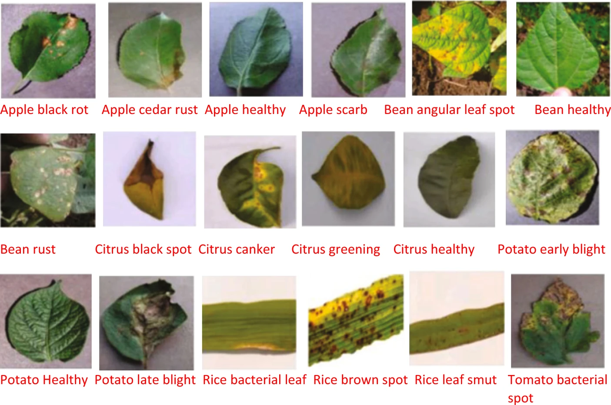
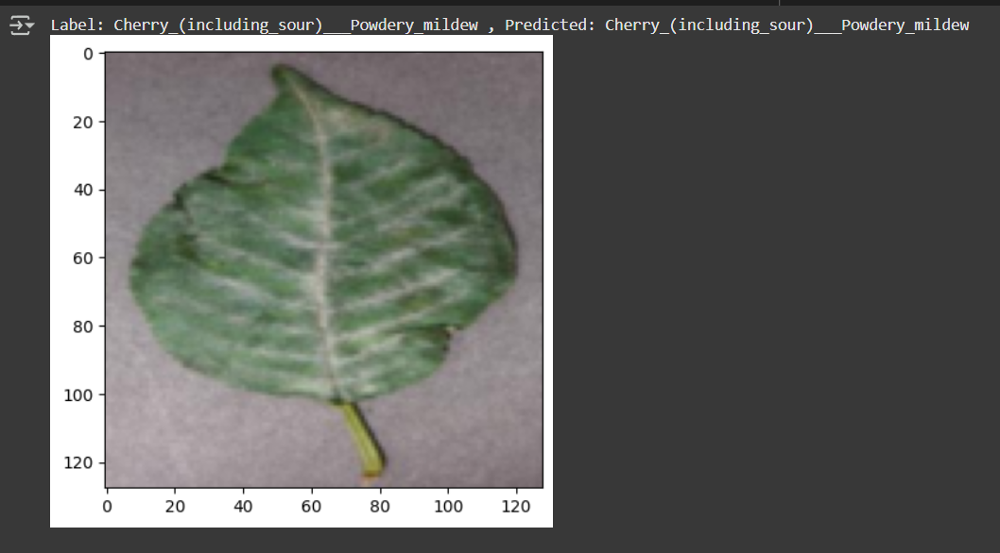
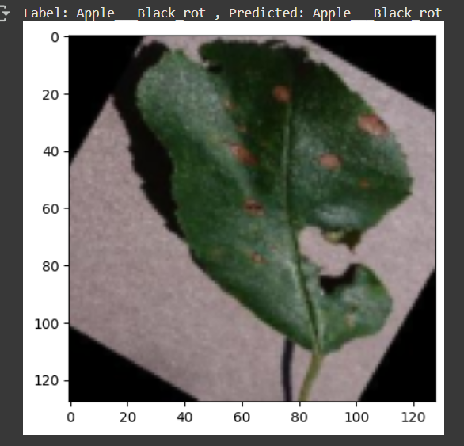

## AgriChikitsa
### [Crop disease Detection by leaf image classification]

## Abstract

Crop diseases pose a critical challenge to agricultural productivity, leading to significant crop losses and economic setbacks for farmers. 
Early and accurate detection of crop diseases is essential for effective disease management, reducing yield losses, and ensuring food security. 
In this project, we propose an automated crop disease detection system leveraging deep learning techniques, particularly Convolutional Neural 
Networks (CNNs), implemented using the TensorFlow framework. The system analyzes high-resolution images of plant leaves to identify and classify various diseases with high accuracy.

This project is an approach to the development of crop disease recognition model, based on leaf image classification, by the use of deep convolutional networks. The developed model is able to recognize 38 different types of crop diseases out of of 14 different crops with the ability to distinguish crop leaves from their surroundings.

## Leaf Image Classification

## 

This process for building a model which can detect the disease associated with the crop image. The key points to be followed are:

1. Data gathering

   The dataset taken was **"New Plant Diseases Dataset"**. It can be downloaded through the link "https://www.kaggle.com/vipoooool/new-plant-diseases-dataset". It is an Image dataset containing images of different healthy and unhealthy crop leaves.

2. Model building

   - I used three models:-
     1. The CNN model architecture consists of CNN Layer, Max Pooling, Flatten a Linear Layers.
     2. Using Transfer learning VGG16 Architecture.
     3. Using Transfer learning resnet34 Architecture.

3. Training
   The model was trained by using variants of above layers mentioned in model building and by varying hyperparameters. The best model was able to achieve  of test accuracy.

4. Testing

   The model was tested on total 17572 images of 38 classes. 
   The model used for prediction on sample images. It can be seen below:
   

   

   
   
   

<!--

6. Various Model Architecture tried along with Learning Rate and Optimizer and various accuracy obtained with different models.

   --> 

## Details about the model

### The model will be able to detect `26` types of `diseases` of `14 Unique plants`

- The detail list of plants and diseases can be seen in [List](Src)
<!--
## Further Work:

- Implementing Image Localisation to find the excat position of the leaf affected .
- Building Recommender system for recommendation of proper presticides and control method for the disease.
- Implementing the appropriate management strategies like fungicide applications and pesticide applications could lead to early
  information on crop health and disease detection.This could facilitate the control of diseases and improve productivity.

## Usage:

- `Flask` : Code for Flask Server and deployment
- `TestImages` : Sample image for model testing
- `Src` : All The source code for building models
- `Models` : All the Pretrained Models of Pytorch
-->
## License

This project is Licensed under `MIT`

